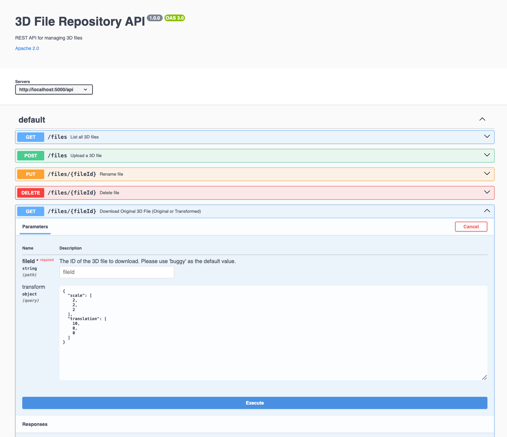
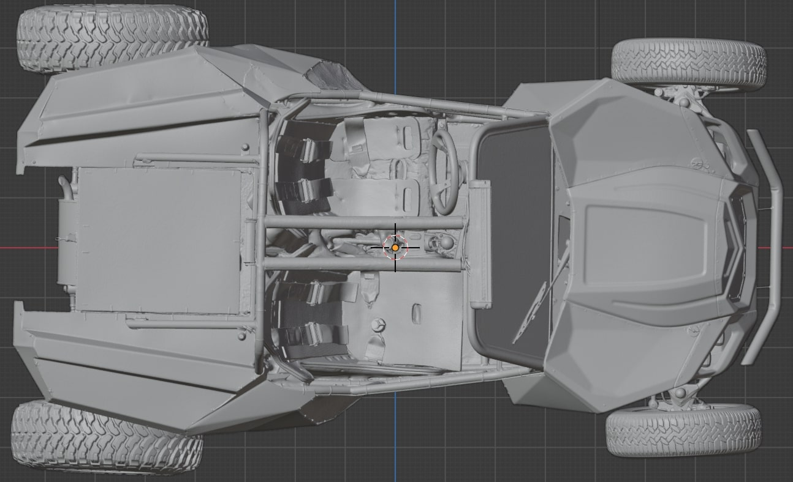
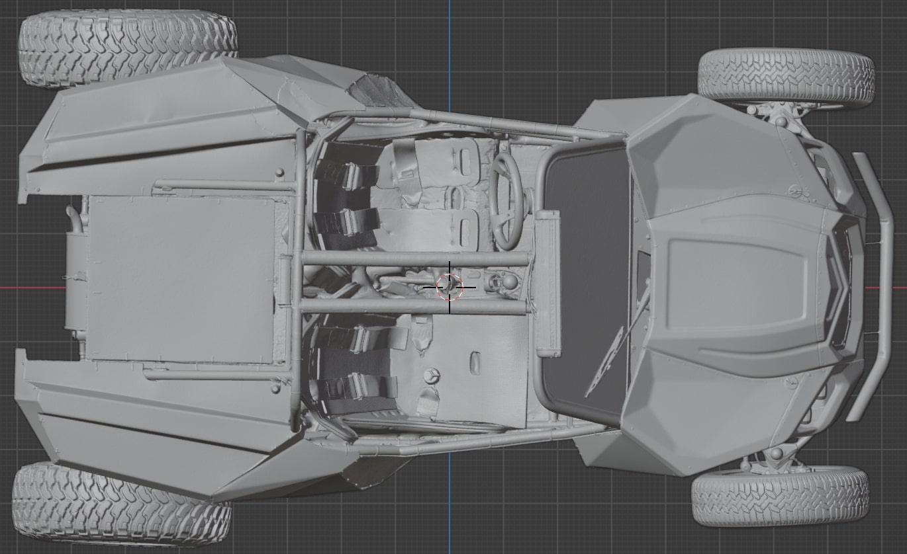

# 3D Filestore API

Thanks to  <u>[3dverse](https://github.com/3dverse/challenge-3dfilestore)</u> for this challenge 

This is an implementation of a REST API of a 3D file repository application

The API provides endpoints to manage and transform 3D object files

## Features for 3D Objects CRUD and Transformation Operations

- Upload 3D files
- Rename 3D files
- Delete 3D files
- Download original 3D files
- **Download transformed 3D files with dynamic scaling and translation**

## Getting Started

To get started with the 3D Filestore API follow these steps:

1. Clone the project repository:

```bash
  git clone https://github.com/franklinkemta/challenge-3dfilestore.git
```

2. Navigate, Install and Serve

```bash
  cd challenge-3dfilestore && npm install
```

3. Start the server

```bash
  npm run serve
```

Visit API docs UI: **[localhost:5000](http://localhost:5000)**


Original buggy obj vertices before transformation

```bash
  # vertices
  v 329.088287 23.088200 739.943176
  v 332.551910 23.978901 738.547974
  v 332.605499 22.584801 738.398682
  # ...
```



Transformed buggy obj vertices after scale and translate vector transformation
```json
  { 
    "scale": [2,2,2], 
    "translation": [10,0,0] 
  }
```

```bash
  # transformed vertices
  v 668.176574 46.1764 1479.886352
  v 675.10382 47.957802 1477.095948
  v 675.210998 45.169602 1476.797364
  # ...
```



## API Reference

The API provides the following endpoints in openapi V3 specification:

- `GET /api/files`: List all 3D files
- `PUT /api/files/:fileId`: Rename a 3D file
- `DELETE /api/files/:fileId`: Delete a 3D file
- `GET /api/files/:fileId/download`: Download the original 3D file
- `GET /api/files/:fileId/download-transformed`: Download the transformed 3D file with dynamic scaling and translation

## Usage Examples

```bash
GET http://localhost:5000/api/files/buggy/download-transformed?scale=[2,2,2]&translation=[10,0,0]
```

This call will stream the transformed 3D object progressively as a download response applying the given transformation e.g { scale: [2,2,2], translate: [10,0,0] } on the original source file vertices and **will not alter the file ⚠️**

## Constraints

- Added **memory usage monitoring** **< ~512Mb**, see src/server.ts file
- Supports **multiple clients** at the **same time**
- Can modify the constant **FILE_READ_CHUNK_SIZE** in src/constants.ts  to tweak and see the output memory variation

## Running Tests

To run tests, run the following command

```bash
  npm run test
```

## Tech Stack

- Node.js
- Express.js
- TypeScript
- swagger-ui-express (for OpenAPI v3 docs UI)
- Jest (for testing)

## License

This project is licensed under the Apache License 2.0 - see the LICENSE file for details.
